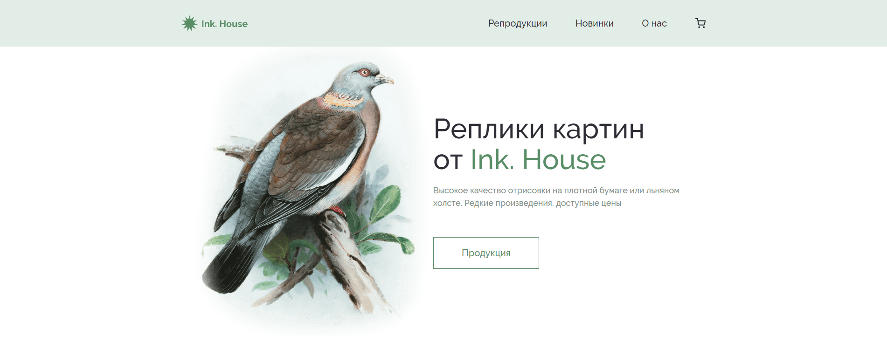
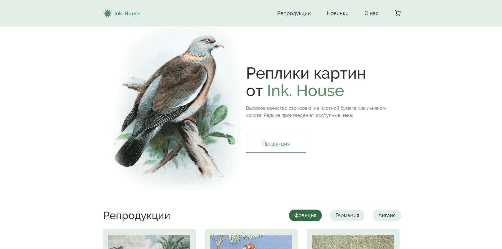
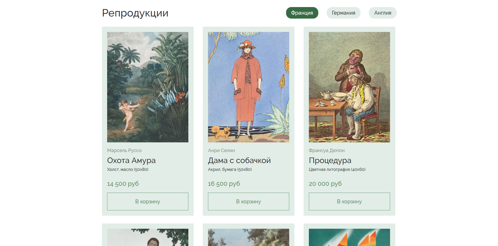
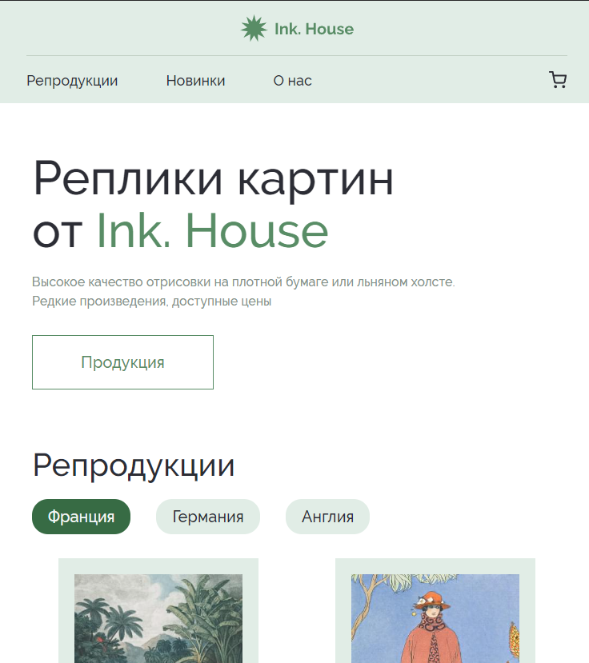
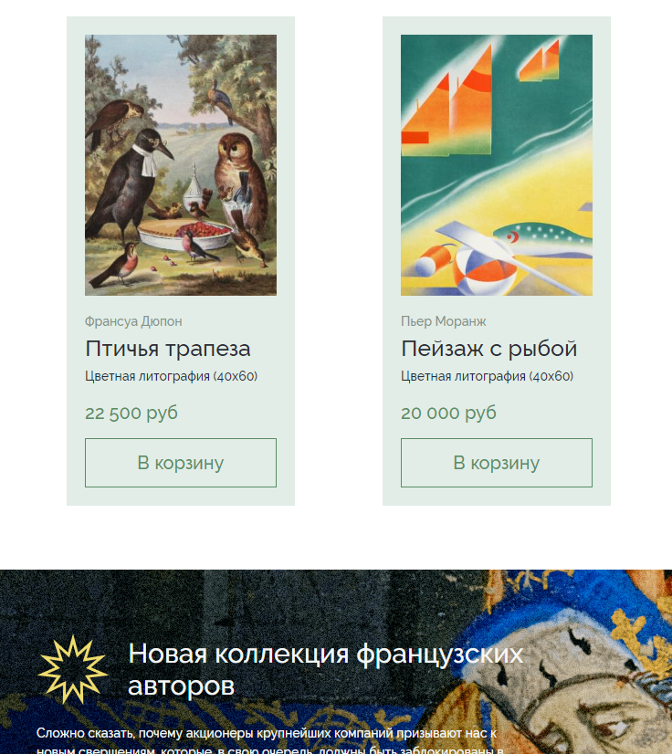
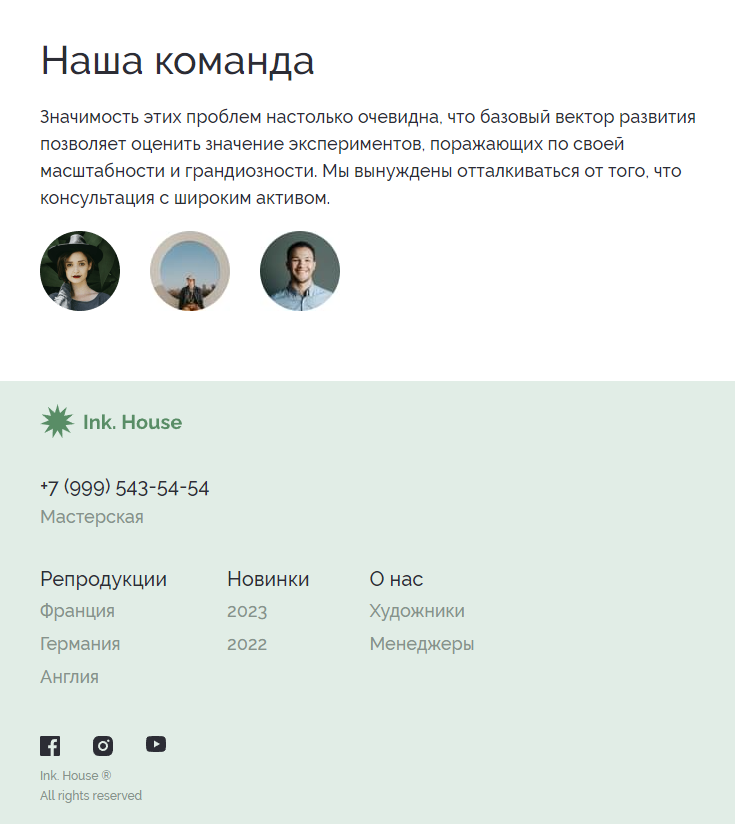
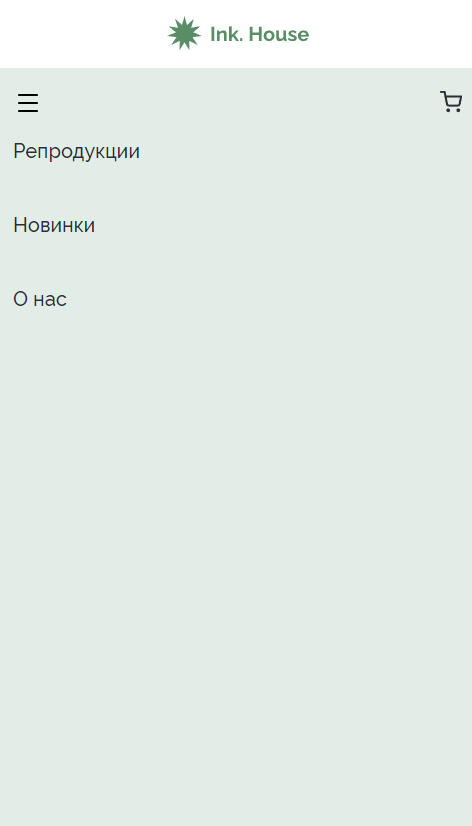
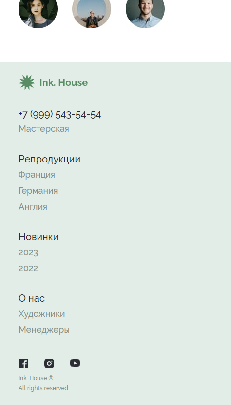

# Inc.House

___

## Description
___

HTML markup of the Inc.House website, where copies of paintings are sold. The layout is adaptive and cross-browser

Source design on Figma: [`*CLICK*`](https://www.figma.com/file/SjHvI8W1yzwJjzyUrCPpsI/House?type=design&node-id=3-838&mode=design&t=Rb62fVGmrktJ6yFO-0)

## Showcases
___

### Desktop

### Tablet

### Mobile

## Installation
___
    git clone https://github.com/1habibi/Inc.House
    npm install
    npm run dev

